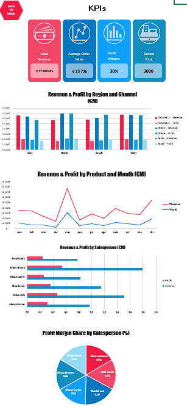

# 🚀 Bootcamp Remote — Portfolio & Learning Journey  

This repository documents my **5-week personal bootcamp**, focused on building a **job-ready junior profile** for roles in **Data, Automation, and Backend basics**.  

It combines **Python, SQL, APIs, Excel/Power Query, and Power BI**, with step-by-step projects and full documentation.  

---

## 🎯 Goals
- Build a strong public portfolio on GitHub.  
- Practice a professional workflow (VS Code + Git + GitHub + WSL).  
- Create reproducible projects with clear documentation.  
- Achieve a competitive level for **remote junior data roles**.  

---

## 📂 Repository structure
- `week1/` → Fundamentals (Python, SQL, Excel/Power Query, first ETL).  
- `week2/` → Data analysis, visualization, APIs, and Power BI dashboards.  
- `week3/` → *(upcoming)* Automation and Web Scraping.  
- `week4/` → *(upcoming)* Open Data projects.  
- `week5/` → *(upcoming)* Final project and portfolio presentation.  

Each week includes its own `README.md` with daily progress and exercises.

---

## 🌟 Featured Projects

- **Excel Advanced Dashboard (ElectraGo, fictitious company)**  
  

- **Power BI Dashboard — Revenue & Profit (GlobalMart, fictitious company)**  
  

- **UrbanMove Dashboard (Open Data API – Santander Bus Stops)**  
  

---

## 📎 Weekly Documentation
- [Week 1 →](./week1/README.md)  
- [Week 2 →](./week2/README.md)  
*(next weeks will be updated in this repository)*  

---

✍️ This repository reflects a **real learning journey**, building not just exercises but a portfolio of professional projects.
