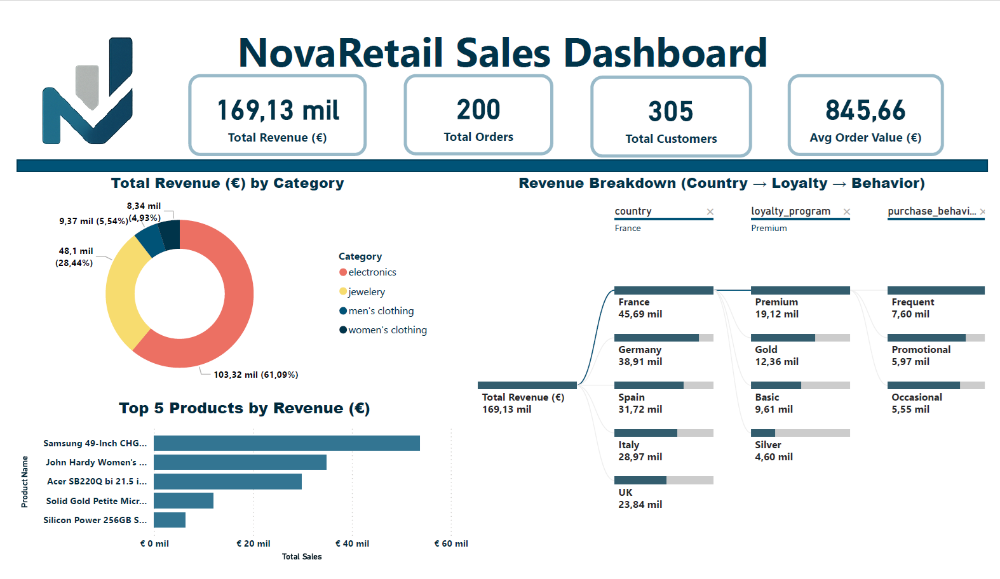
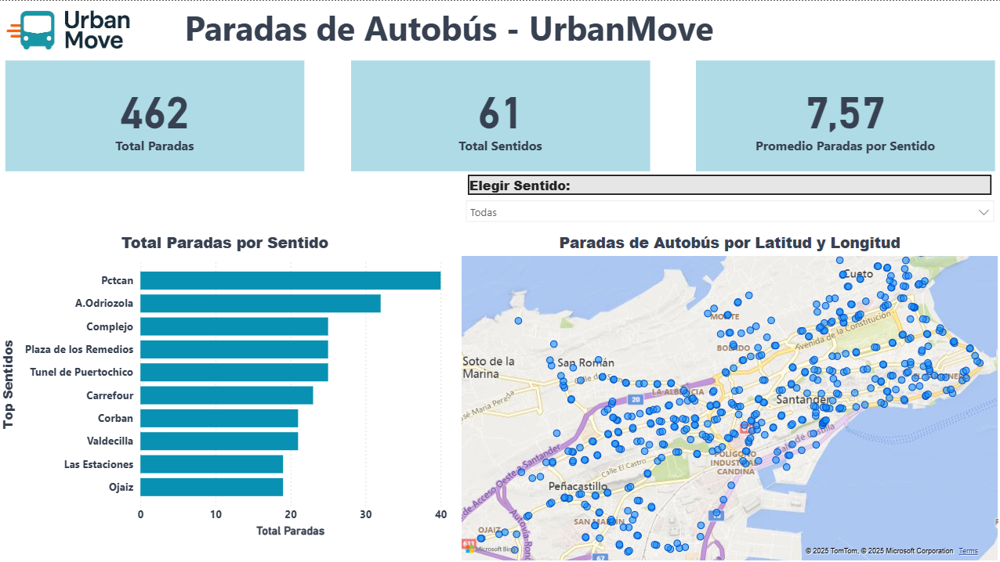
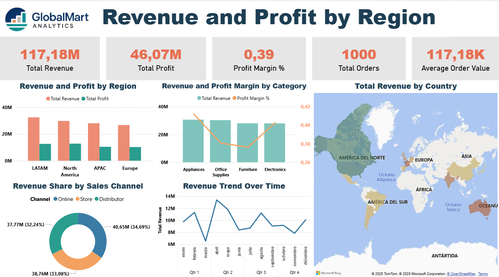
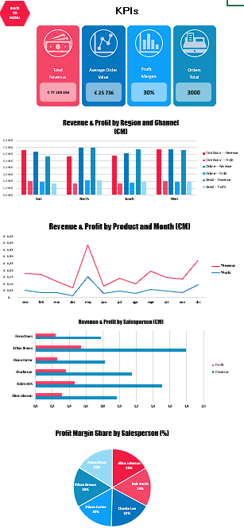

# 🚀 Bootcamp Remote — Portfolio & Learning Journey  

This repository documents my **4-week personal bootcamp**, focused on strengthening my profile as a **Data Analyst** through hands-on projects and modern tools.
 

It combines **Python, NumPy, Pandas, SQL, APIs, Excel/Power Query, and Power BI**, with step-by-step projects and full documentation.  

---

## 🎯 Goals
- Build a strong public portfolio on GitHub.  
- Practice a professional workflow (VS Code + Git + GitHub + WSL).  
- Create reproducible projects with clear documentation.  
- Strengthen my profile as a **Data Analyst**, combining previous professional experience with new technical skills in Python, SQL, and Business Intelligence.  
- Keep learning and practicing through personal projects to stay updated with modern tools and methodologies.  

---

## 📂 Repository structure
- `week1/` → Fundamentals (Python, SQL, Excel/Power Query, first ETL).  
- `week2/` → Data analysis with NumPy & Pandas, data visualization (Matplotlib/Seaborn), APIs, and Power BI dashboards.  
- `week3/` → SQL with PostgreSQL, ER modeling and normalization (3NF), advanced queries, and the **NovaRetail Dashboard** in Power BI.  
- `week4/` → ETL advanced with Pandas & SQLAlchemy, SQL business queries, NumPy, statistics, exploratory analysis, and a simple ML model (scikit-learn).  

Each week includes its own `README.md` with daily progress and exercises.

---

## 🌟 Featured Projects

- **NovaRetail Dashboard (Power BI – fictitious retail company)**  
  

- **UrbanMove Dashboard (Open Data API – Santander Bus Stops)**  
  

- **Power BI Dashboard — Revenue & Profit (GlobalMart, fictitious company)**  
  

- **Excel Advanced Dashboard (ElectraGo, fictitious company)**  
  

---

## 📎 Weekly Documentation
- [Week 1 →](./week1/README.md)  
- [Week 2 →](./week2/README.md)  
- [Week 3 →](./week3/README.md)  
- [Week 4 →](./week4/README.md)  

---

✍️ This repository reflects a **real learning journey**, building not just exercises but a portfolio of professional projects in Data Analysis.  
