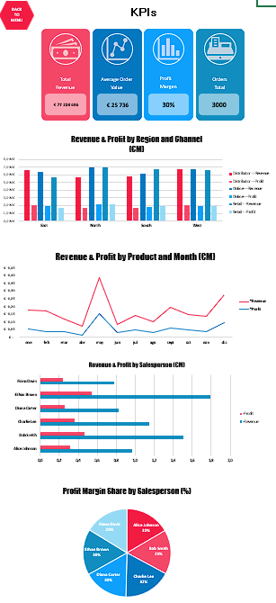

# **Sales Dashboard – Excel Interactive Report** 📊  

## **Overview**  
This project is a professional **Excel interactive dashboard** developed as part of the **Bootcamp – Block B3**.  
It showcases advanced Excel skills including PivotTables, PivotCharts, calculated fields, slicers, and custom formatting to create a **fully functional, dynamic sales analysis tool**.  

The dataset simulates an **electronics store** with over **3,000 sales transactions**, covering multiple products, categories, sales channels, regions, and salespeople.  

---

## **Main Features** 🚀  
- **3 Core KPIs**:
  - **Total Revenue**
  - **Average Order Value**
  - **Profit Margin**
- **4 Interactive Charts**:
  1. **Revenue & Profit by Region and Channel** – Clustered column chart with calculated metrics.
  2. **Revenue & Profit by Product and Month** – Dynamic line chart to analyze seasonal trends.
  3. **Revenue & Profit by Salesperson** – Horizontal bar chart for team performance analysis.
  4. **Profit Margin Share by Salesperson** – Pie chart highlighting contribution percentages.
- **Dynamic Filters (Slicers)**: Filter by Year, Region, Channel, Category, Product, and Salesperson.
- **Calculated Fields** for **Profit Margin** and custom number formatting (millions of euros).
- **Clean & Professional Layout**:
  - Custom color palette and icons.
  - Consistent typography and spacing.
  - “Back to Menu” navigation button for better UX.  

---

## **Technologies & Skills Used** 🛠  
- Microsoft Excel (PivotTables, PivotCharts, Slicers, Conditional Formatting)
- Data analysis and KPI design
- Dashboard UX/UI design principles
- Calculated fields and custom formulas
- Data visualization best practices

---

## **How to Use** 🖱  
1. Download the file: [Sales_Dashboard.xlsx](Sales_Dashboard.xlsx)  
2. Open in **Microsoft Excel (desktop version)** – *full functionality may not work in web mode*.  
3. Use the slicers to filter data and watch the dashboard update in real-time.

---

## **Preview** 🖼  

### Full Dashboard  
  

### Main KPIs  
  

### Revenue & Profit by Region & Channel  
  

### Revenue & Profit by Product  
  

### Profit Margin Distribution  
  

### Interactive Menu  
  

---

## **Author** ✍ 
**Francella Rojas Castillo**  
- 💼 [LinkedIn Profile](https://www.linkedin.com/in/francellarojascastillo/)  
- 📂 [GitHub Portfolio](https://github.com/Franchutech)  

---

📌 *This dashboard was created as part of the Bootcamp B3 project, demonstrating advanced Excel data analysis and visualization skills for professional portfolios.*

