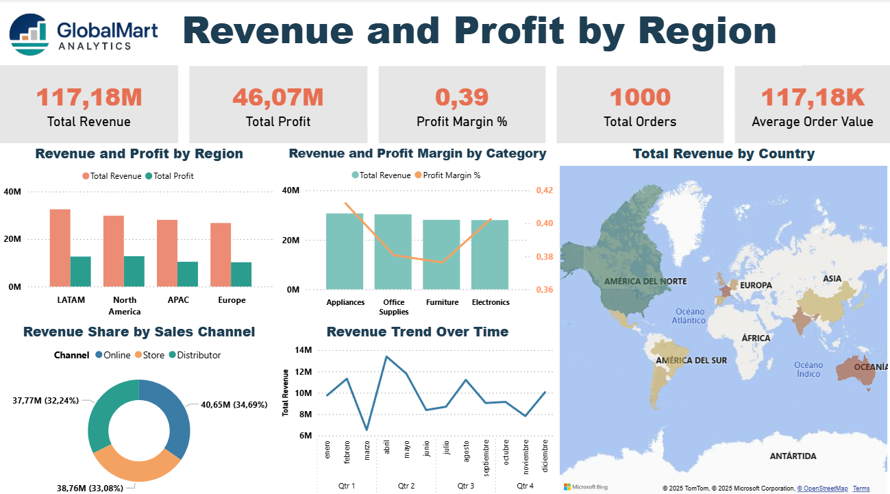
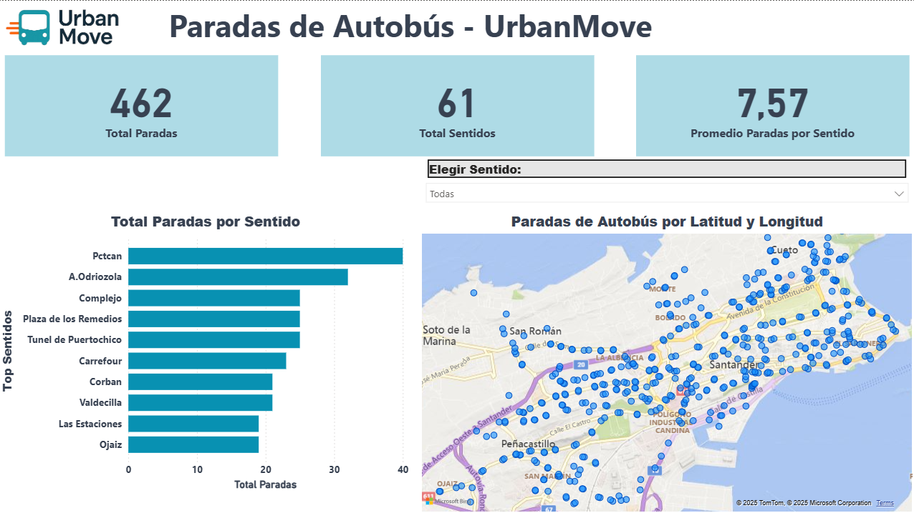

## 📅 Resumen Semana 2 (Días 8 a 14)

- **Día 8 (Lunes):**  
  Trabajo con Pandas: lectura de archivos, inspección de datos y limpieza básica.  
  Ejercicios prácticos en notebook con 20 ejemplos guiados.  

- **Día 9 (Martes):**  
  Introducción a NumPy: arrays, shape, operaciones y broadcasting.  
  Pandas: agrupaciones, agregaciones y uniones de tablas.  
  Casos prácticos (KPIs): salario promedio, Top N y tendencias por fecha.  

- **Día 10 (Miércoles):**  
  Visualización de datos: introducción a gráficos con Python.  
  - **Matplotlib:** gráficos de línea, barras, histogramas y subplots con personalización de títulos, ejes y estilos.  
  - **Seaborn:** gráficos estadísticos (catplot, histplot y heatmap de correlaciones) utilizando datasets de práctica.  
  - **Notebook `viz.ipynb`:** integración de 6–8 gráficos documentados como informe visual, listo para README y presentación.  

- **Día 11 (Jueves):**  
  Introducción a **APIs**: uso de Postman, endpoints, parámetros y tokens.  
  Consumo de APIs en Python con `requests`, guardando resultados en JSON y CSV.  
  Ejercicios prácticos con: JSONPlaceholder, NASA APOD, Countries, AviationStack (flights) y MET Museum (art).

- **Día 12 (Viernes):**  
  Introducción a **Power BI**: carga de datos, limpieza básica y modelado.  
  Creación de medidas en **DAX** para KPIs clave (Revenue, Profit, Margin, Orders, AOV).  
  Diseño de un **dashboard corporativo** con logo, cards, gráficos (barras, columnas, donut, líneas) y un **mapa geográfico** interactivo.  
  Exportación final en `.pbix`, `.png` y grabación de video de presentación.

  

- **Día 13 (Sábado):**  
  Proyecto 2 **“UrbanMove – Open Data Dashboard”**.  
  - Conexión a la **API de datos abiertos de Santander** (`paradas_bus.json`).  
  - **Pipeline en Python**: extracción, limpieza, normalización de lat/long y exportación a CSV.  
  - **Integración en Power BI**:  
    - KPIs: Total de paradas, Total de sentidos, Promedio de paradas por sentido.  
    - **Mapa interactivo** con segmentador por sentido.  
    - **Top 10 sentidos con más paradas** (gráfico de barras).  
  - Exportación final: `.pbix`, `.png` y documentación en README.  

  

- **Día 14 (Domingo):**  
  Jornada de repaso y cierre de la semana.  
  - **NumPy y Pandas:** 10 ejercicios extra realizados en script Python (`B1_pandas_numpy_review.py`), abarcando arrays, operaciones estadísticas, matrices, transposición y creación de DataFrames.  
  - **Organización del repositorio:** verificación de estructura, limpieza de carpetas y actualización de README.  
  - Preparación de la siguiente semana (SQL intermedio, Python intermedio y DevOps básico).
